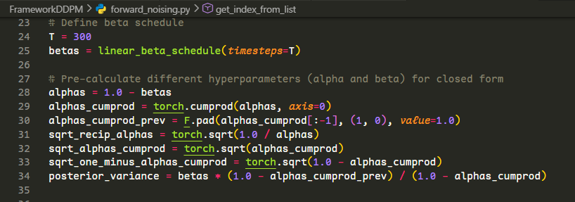
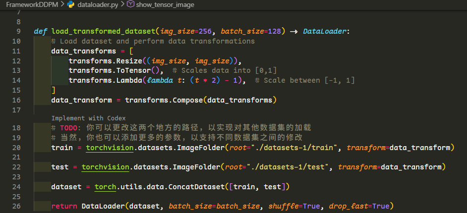
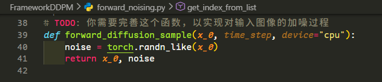
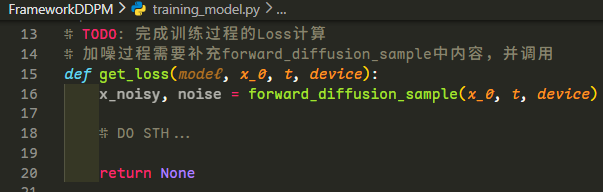
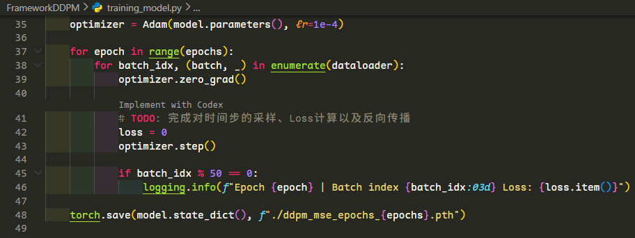
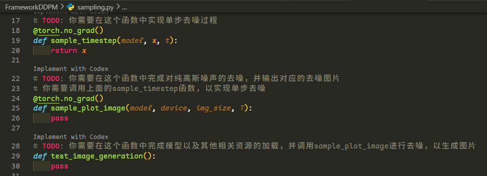

# 基础内容

本次作业**基础内容需要修改的部分**为代码框架中以**TODO标记部分的子集**。在完成基础部分后，运行sampling.py，即可得到生成的图像

## 前向加噪过程

预定义常量，含义同常量名。如果不知道常量名啥意思，请参考课程PPT或者自己看常量计算过程并与DDPM中$\alpha_t, \beta_t$相关项自行对应。

数据加载

加噪函数

## 训练迭代过程

损失函数计算

优化循环

## 逆向去噪过程

你需要补全下面的几个函数，并自行保存输出的图片(可以使用matplotlib的[imshow](https://matplotlib.org/stable/api/_as_gen/matplotlib.pyplot.imshow.html)或者torchvision的[save_image](https://docs.pytorch.org/vision/main/generated/torchvision.utils.save_image.html)函数)

