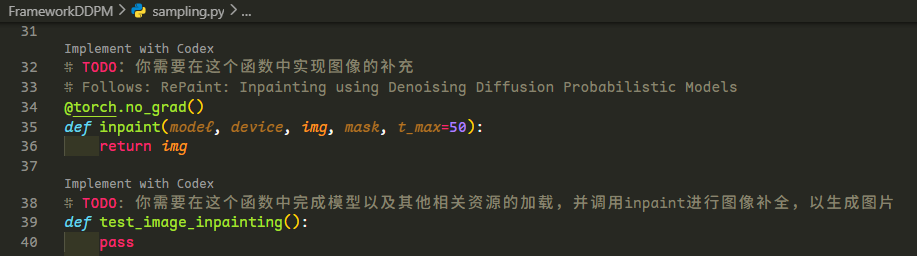

# Inpainting

We follow: [RePaint](https://arxiv.org/abs/2201.09865)[CVPR 22]

你需要完成下面的几个函数以实现RePaint文章中所提到的方法。补充完整后，运行sampling.py即可获取对应的填充后图片。你需要自行保存输出的图片(可以使用matplotlib的[imshow](https://matplotlib.org/stable/api/_as_gen/matplotlib.pyplot.imshow.html)或者torchvision的[save_image](https://docs.pytorch.org/vision/main/generated/torchvision.utils.save_image.html)函数)

