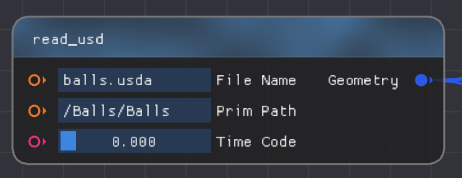
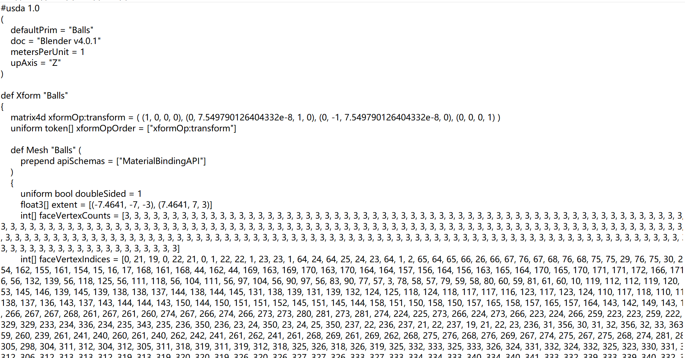
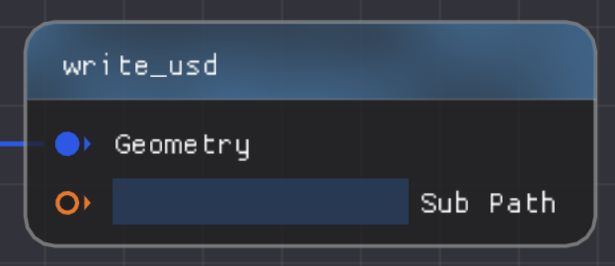
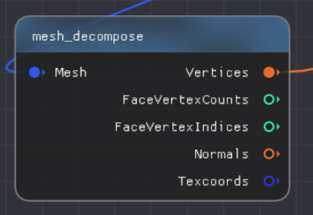
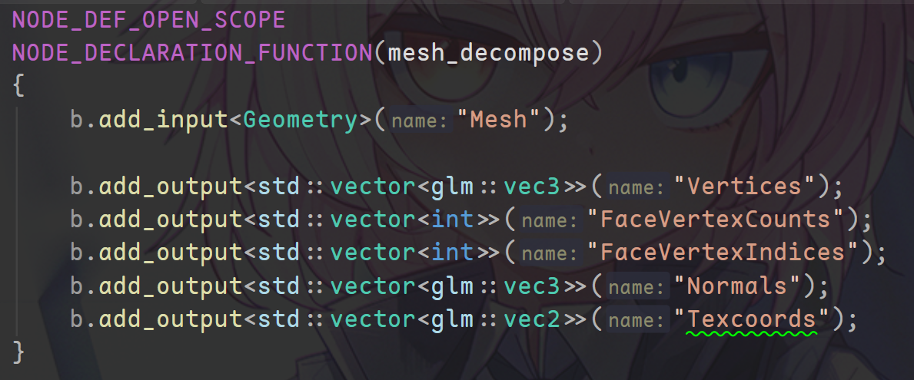
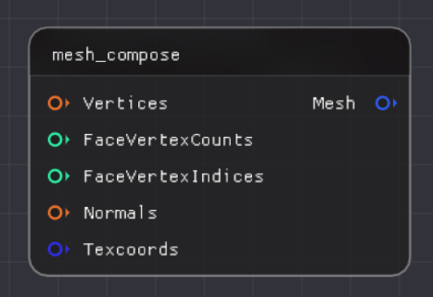
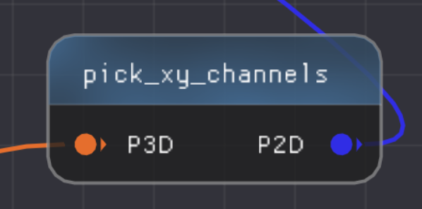
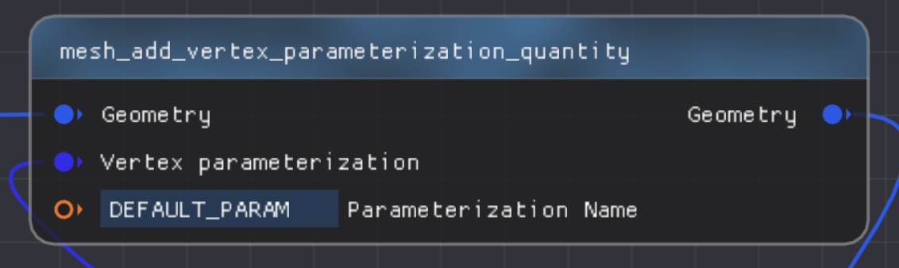
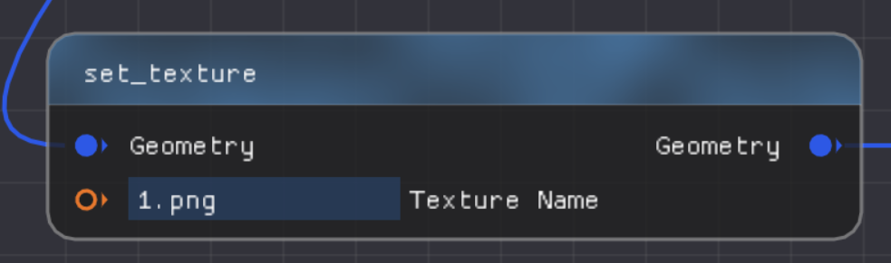

# 基本节点介绍

## 1. 文件的读入与输出

网格文件的读入有许多方式，以这次的作业为例，我们使用read_usd来读入一个网格，其基本节点如下所示：

File Name内填的是文件的路径，内部可以填绝对路径，也可以填相对路径（我们**推荐使用相对路径**，相对路径是**相对于可执行程序的路径**）

Prim Path内部填写的是文件的基本路径，比如要打开Balls.usda，则以文本打开这个文件，会显示如下信息：

内部Xform以及Mesh所显示的提示我们**填入/Balls/Balls**，注意这里**用的是“/”而不是“\”**，我们要导入其他.usda文件也可以这么导入，第三个则暂时不用管。

输出则是geometry类型，至于怎么使用这个类型，可以参考所给的例子[Ruzino-Homework/source/Editor/geometry_nodes/node_curvature.cpp at 2c412b6f08e4397b7d787bbddffb89f279004522 · SyouSanGin/Ruzino-Homework](https://github.com/SyouSanGin/Ruzino-Homework/blob/2c412b6f08e4397b7d787bbddffb89f279004522/source/Editor/geometry_nodes/node_curvature.cpp#L6)

将mesh之类的显示出来则需要使用write_usd，其基本节点如下所示：

## 2. 网格的组成与分解

如果想取出网格中的特定元素，我们则可以使用下面这个节点：

mesh_decompose节点，其输入一个网格，输出则是其点以及一些内部的属性。其中输入输出的具体数据类型如图所示：

这里提一嘴，对于其他节点，如果**不知道输入和输出的数据类型是什么**，可以善**用搜索功能找到这个文件来看看add_input和output里面写的是什么类型**。

同样的，如果我们想要组成一个mesh网格，我们可以使用这个节点：

这个节点相当于上一个节点的反向使用，使用如图所示的一些数据来组成一个网络，数据结构跟上面是一样的。

ps：如果**接口的颜色不同**，说明了**数据结构是不同**的，连接不同的数据结构是无法操作的！！！

## 3. 提取XY坐标

由于我们需要将XY通道作为最终的参数化坐标，在分解Mesh元素得到3D顶点后需要提取其前两个坐标。这一步可以用到下面这个节点：

## 4. 纹理的操作

贴一个纹理，我们需要网格顶点的参数坐标，而如下图则是设置一个网格的纹理坐标的节点：

输入一个网格，再输入一个顶点的参数化坐标（注意，参数化坐标是一个二维向量）得到一个带有参数化坐标的网格。虽然mesh_compose也有Texcoords这项输入，不过我们把这个单独拎出来可能更容易理解一点。其中参数化的名字不用管，没什么用。

以下节点则是设置纹理的操作：

输入一个网格（带有参数化坐标），以及一个纹理文件，输出一个带有纹理贴图的网格。这里输入的Texture Name则与read_usd相同，可以使用绝对路径，也可以使用相对路径，同样推荐使用相对路径。

有了这些认识回头再去看看所给出的示例节点图，说不定会有一些新的认识。