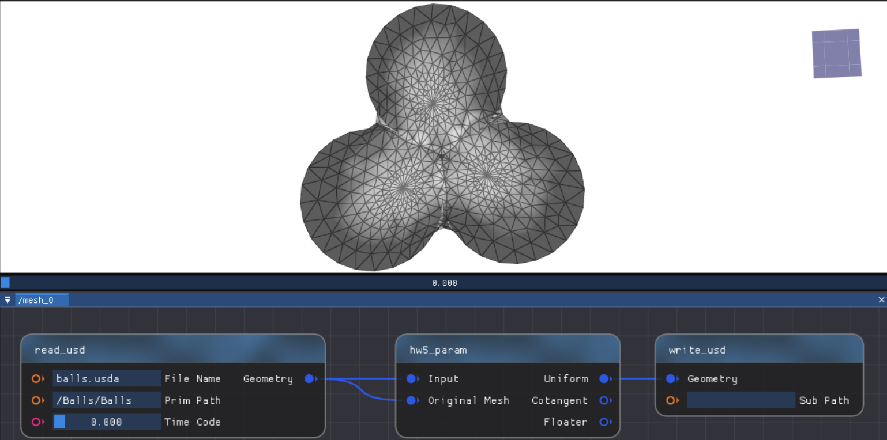
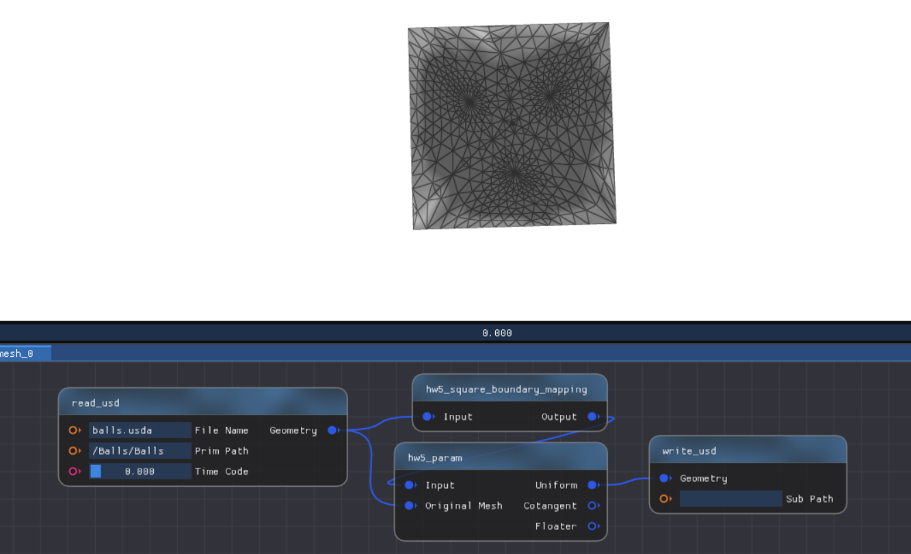
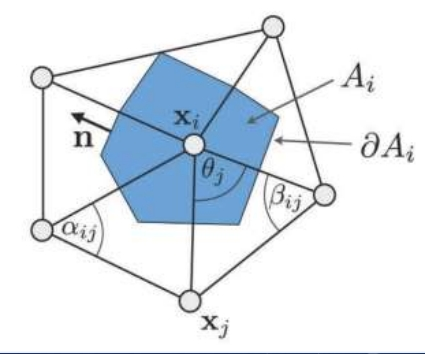
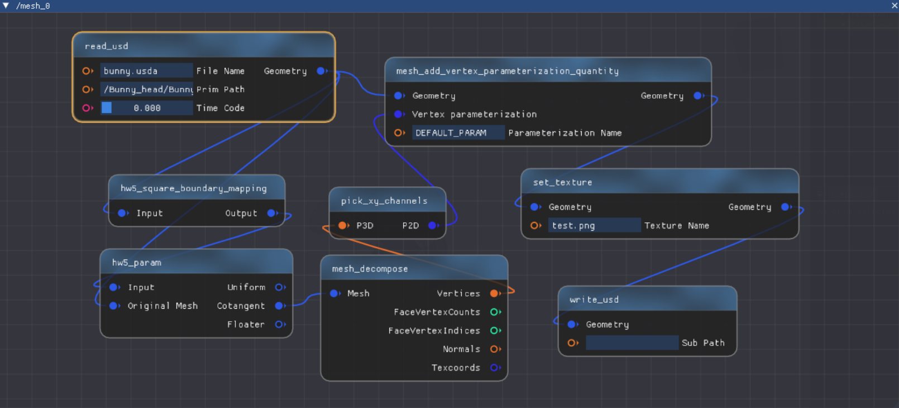
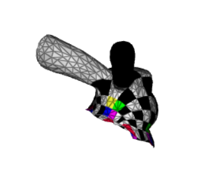

# 作业说明

## 学习过程

- 阅读 [Ruzino框架配置说明](https://github.com/SyouSanGin/Ruzino-Homework/blob/main/README.md)并配置框架
  - 目前没必要深入学习框架的实现，只需参考文档和[网格处理示例](./mesh_process_example.md)了解 **单个** 节点 `.cpp` 文件的编写，即可轻松完成后续作业；
- 阅读 [网格处理示例](./mesh_process_example.md) 学习网格的基本表达方式，以及我们将用到的 OpenMesh 库
  - 学习如何通过半边结构**遍历**顶点、面、边以及访问他们的**邻域**等；
- **模仿**网格处理的示例，参考相关公式补充[hw5_boundary_map.cpp](https://github.com/SyouSanGin/Ruzino-Homework/blob/main/source/Editor/geometry_nodes/hw5_boundary_map.cpp)、[hw5_param.cpp](https://github.com/SyouSanGin/Ruzino-Homework/blob/main/source/Editor/geometry_nodes/hw5_param.cpp)等文件，连接节点图，实现简单的极小曲面和参数化效果。

> [!Note]
> 根据选取的权重不同，Tutte 参数化有不同的结果！

## 测试网格

我们提供了若干具有一条边界的**三角网格**，见 [data/](../data/) 目录，它们的表达格式是 Universal Scene Description (USD)，参考[网格数据说明](../data/README.md)

## 测试纹理

可以使用 [测试纹理](../data/test.png) 对参数化网格进行纹理贴图，检验并测试参数化的结果。

<div align=center></div align>

## 1. 固定边界求解极小曲面

我们需要在[hw5_param.cpp](https://github.com/SyouSanGin/Ruzino-Homework/blob/main/source/Editor/geometry_nodes/hw5_param.cpp)，实现网格上（均匀权重）的 **Laplace方程的建立和求解**，**边界条件仍然选取为原来的空间点位置**，就可以求解得到固定边界下的"**极小曲面**"。

主要步骤：

- 检测边界
- 固定边界
- 构建稀疏方程组
- 求解稀疏方程组
- 更新顶点坐标

### 参考公式

#### 顶点的微分坐标

$$
\boldsymbol\delta _ i = \boldsymbol{v _ i} - \sum _ {j \in N(i)} w _ j \boldsymbol{v _ j},
$$

其中 $N(i)$ 表示顶点 $i$ 的 1-邻域.

#### 极小曲面计算

固定边界点坐标，取均匀权重下的 $\boldsymbol{\delta} _ i = \boldsymbol{0}$ 即

$$
\frac{1}{d _ i} \sum _ {j\in N(i)} (\boldsymbol{v} _ i - \boldsymbol{v} _ j) = \boldsymbol{0}, \quad \text{for all interior } i .
$$

### 参考的节点连接图（这里有关节点的简单介绍[->](../NodeIntroduction.md/)）

我这里演示的版本中，hw5_param节点的部分输入输出你们作业框架中是默认没有的，这是我为了做演示所以添加了一些其他的输入输出。**默认的输入只有一个，输出也只有一个**。你们在完成这个节点后，直接链接输入输出即可得到相同的效果。

你们在完成作业的过程中，请**自行根据需要添加输入输出**！



> [!tip]
> 提示
> 
> ```cpp
> halfedge_handle.is_boundary()；
> ```
> 
> 可以判断是否是边界，加上遍历很容易判断出哪些点是落在边界上的。
> 
> 固定边界取决于你设置的边界，你可以通过.idx()来找到点的索引，再通过点的索引来找到点的位置，进而设置点的坐标。
> 
> 这里还要说明的一点是read_usd的路径问题，以Balls举例，File Name里面填的既可以是绝对路径，也可以是相对路径，其相对路径实在Binaries/debug或release里面的，这里推荐使用相对路径。prim path可以打开Balls.usda，可以看到里面定义的路径，没有大的变动基本上就跟我输入进去的一样。

## 2. 修改边界条件得到平面参数化

### 2.1 边界映射

完成[hw5_boundary_map.cpp](https://github.com/SyouSanGin/Ruzino-Homework/blob/main/source/Editor/geometry_nodes/hw5_boundary_map.cpp)，把网格**边界映射到平面凸区域的边界**（正方形、圆形）。可以可视化检查结果的正确性。请保证**映射后的区域落在$[0,1]^2$中**。

### 2.2 参数化求解

在上述边界条件下求解同样的 Laplace 方程，可以得到（均匀权重的）**Tutte 参数化**。（连接以上两个节点！）

### 参考的节点连接图



## 3. 尝试比较不同的权重

计算不同权重下的 **Tutte 参数化**，例如

- （要求实现）Cotangent weights 
- （可选）shape-preserving weights （[Floater weights](https://www.cs.jhu.edu/~misha/Fall09/Floater97.pdf)）。

uniform 的权重可以两个节点连成，就如上图。但要注意下，conform的权重要用原网格来算，**得加个 reference mesh 的输入，就像我这里的hw5_param节点一样**。

### 参考公式

#### Tutte 参数化计算

分布边界点的坐标到平面凸区域的边界，求解同样的方程组：

$$
\boldsymbol{v _ i} - \sum _ {j \in N(i)} w _ j \boldsymbol{v _ j} = \boldsymbol{0}, \quad \text{for all interior } i .
$$

#### 权重选取

- Uniform weights: $w _ j = 1$;
- Cotangent weights: $w _ j = \cot \alpha _ {ij} + \cot \beta _ {ij}$（注意和原网格的几何有关）;
- Floater's shape-preserving weights (optional): 参考论文 [Floater1997](https://www.cs.jhu.edu/~misha/Fall09/Floater97.pdf)； 
- 归一化处理 :

$$ w _ j = \frac{w _ j}{\displaystyle \sum_k w_k }.$$

<div align=center></div align>

> [!Note]
> 
> - 你可以根据需求任意添加节点，或者给节点增加额外的输入、输出（不限于框架的设置）；
> - 鼓励对实现的算法进行类的封装。

> [!Note]
> **思考：高亏格曲面？**

## 4. 纹理可视化

根据参数坐标，可以给网格贴上纹理图片。可以参考下面的例子进行节点的连接：



